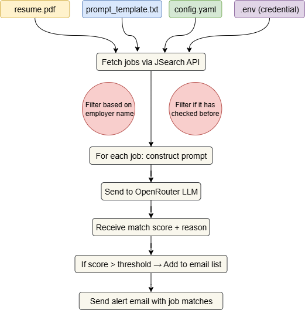

# 📬 Smart Job Alerts

**Automatically find and send job alerts tailored to your resume and job preferences.**
This app fetches job postings using JSearch, a powerful job listing API available on RapidAPI. For each job, it uses your resume and a customizable LLM prompt to evaluate relevance via OpenRouter (supporting models like Moonshot or DeepSeek). It compares jobs against a user-defined match threshold and sends an email containing the top matches — each with a match score and a short summary explaining why the job does or doesn’t match.
**You can run the app automatically using GitHub Actions to receive alerts on a regular schedule (e.g., once a day).**


<p align="center">
  
</p>

---

## 📑 Table of Contents

- [🎯 Goal](#-goal)
- [🚀 Two Ways to Use This App](#-two-ways-to-use-this-app)
- [🧠 How It Works](#-how-it-works)
- [📦 Required Files & Configurations](#-required-files--configurations)
- [📩 Step 1: Set Up API Access](#-step-1-set-up-api-access)
- [⚙️ Option 1: GitHub Action Setup (Automatic Email Alerts)](#️-option-1-github-action-setup-automatic-email-alerts)
- [🐳 Option 2: Run with Docker Locally (Manual Email Alerts)](#-option-2-run-with-docker-locally-manual-email-alerts)
- [🛠 Example Prompt Template](#-example-prompt-template)
- [🧪 Testing Locally](#-testing-locally)
- [✉️ Example Alert Email](#️-example-alert-email)
- [📜 License](#-license)
- [🙋 Questions?](#-questions)

---

## 🎯 Goal

Manually searching through job boards is time-consuming and inefficient. 
Even when using job alert features from platforms like LinkedIn or Indeed, results are often flooded with irrelevant listings — including posts from consulting firms, third-party recruiters, 
or positions that don’t match your background. You still have to open each one manually to assess whether it's a real fit, which can be frustrating and overwhelming.

**Smart Job Alerts** automates this entire process by:
- Fetching fresh job listings using the **JSearch API** (via RapidAPI)
- Filtering out unwanted employers or jobs you’ve already seen
- Evaluating relevance with your **resume** and a **custom prompt template**, scored using an LLM via OpenRouter (e.g., Moonshot, DeepSeek, or Kimi-K2)
- Sending you only the top matches that exceed your configured score threshold
- Including a short explanation for why each job was matched — giving you clarity and saving time

---

## 🚀 Two Ways to Use This App

### Option 1: Use GitHub Actions (Automatic Alerts)

Automatically run the job matching every day (or on schedule) using GitHub Actions.

### Option 2: Use Docker Locally (Manual Alerts)

Run the app manually using a Docker image. Recommended if you prefer CLI over GitHub automation.

---

## 🧠 How It Works

1. You provide a **resume (PDF)** and a **prompt template**.
2. Jobs are fetched from RapidAPI.
3. For each job, the full job description + qualifications/responsibilities are passed to an LLM.
4. The LLM scores each job and provides a justification.
5. Matching jobs are emailed to you using Gmail SMTP.

---

## 📦 Required Files & Configurations

These files must exist before running the app:

| File                          | Description                                                                 |
| ----------------------------- | --------------------------------------------------------------------------- |
| `.env`                        | API keys and email credentials (based on `.env.example`)                    |
| `data/resume.pdf`             | Your actual resume (PDF format)                                             |
| `data/prompt_template.txt`    | LLM prompt template with placeholders like `{resume_text}` and `{job_desc}` |
| `data/seen_jobs.json`         | Tracks which jobs you've already seen (starts as empty `[]`)                |
| `data/blocked_employers.yaml` | Employers you want to skip (starts as `blocked_employers: []`)              |
| `config.yaml`                 | Job search filters (keywords, location, email, thresholds, etc.)            |

---

## 📩 Step 1: Set Up API Access

You need a **RapidAPI account** to fetch job data.

1. Sign up at [rapidapi.com](https://rapidapi.com/)
2. Subscribe to the **JSearch API** (free tier available - 100 per day)
3. Note your:
   - `RAPIDAPI_KEY`
   - `RAPIDAPI_HOST` (usually `jsearch.p.rapidapi.com`)

You also need:

- A Gmail account with **App Password** enabled (for sending alerts)
- An account on [OpenRouter.ai](https://openrouter.ai) to get an API key for LLM access

---

## ⚙️ Option 1: GitHub Action Setup (Automatic Email Alerts)

### 🧬 Prerequisites

- GitHub account
- Resume PDF & config files prepared

### 🛠️ Step-by-Step:

1. **Clone the Repo**

   ```bash
   git clone https://github.com/msmalmir/Smart-Job-Alerts.git
   cd Smart-Job-Alerts


2. **Set Up Files**

  ```bash
    cp .env.example .env
    cp data/seen_jobs_example.json data/seen_jobs.json
    cp data/blocked_employers_example.yaml data/blocked_employers.yaml
  ```

- Replace `data/resume_example.pdf` with your actual `resume.pdf`
- Edit config.yaml to match your preferences


3. **Create GitHub Secrets**
Go to your repo → Settings → Secrets → Actions and add:

EMAIL_USERNAME

EMAIL_PASSWORD

RAPIDAPI_KEY

RAPIDAPI_HOST

OPENROUTER_API_KEY
